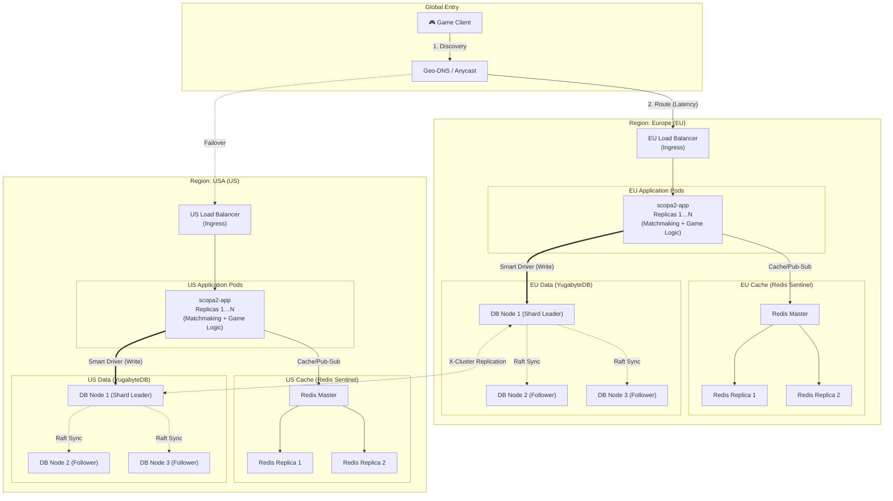
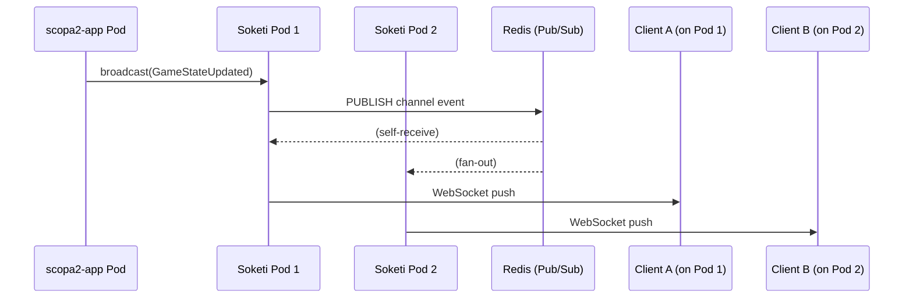
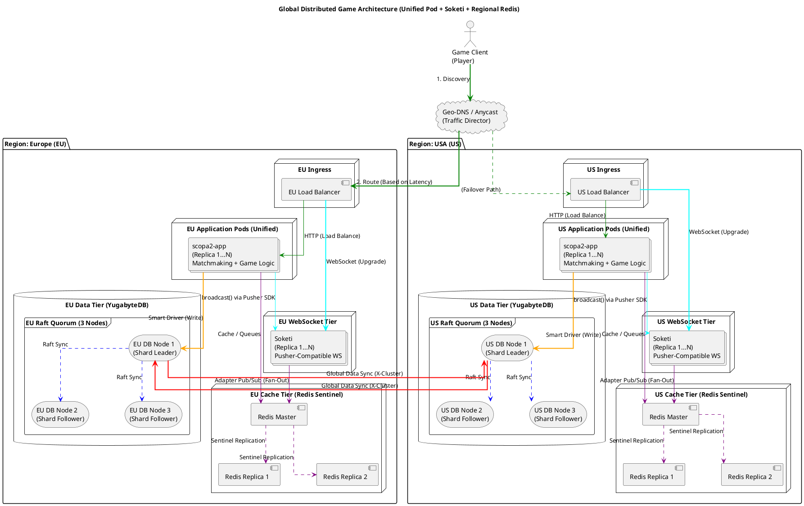
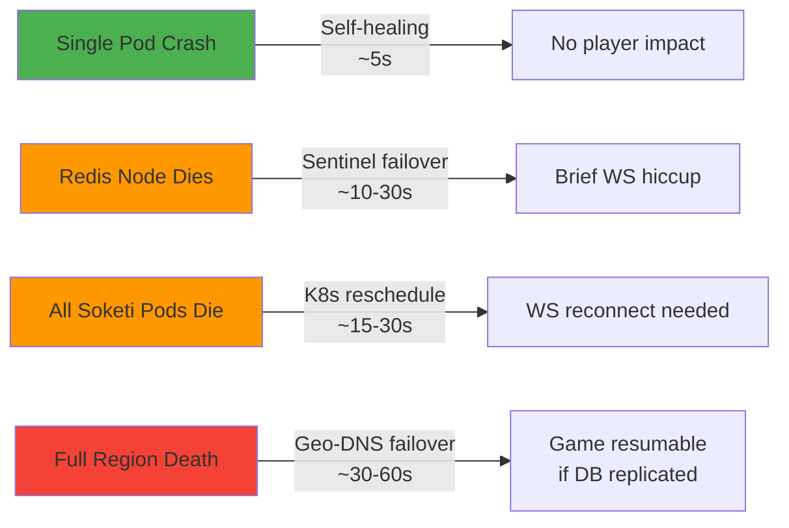
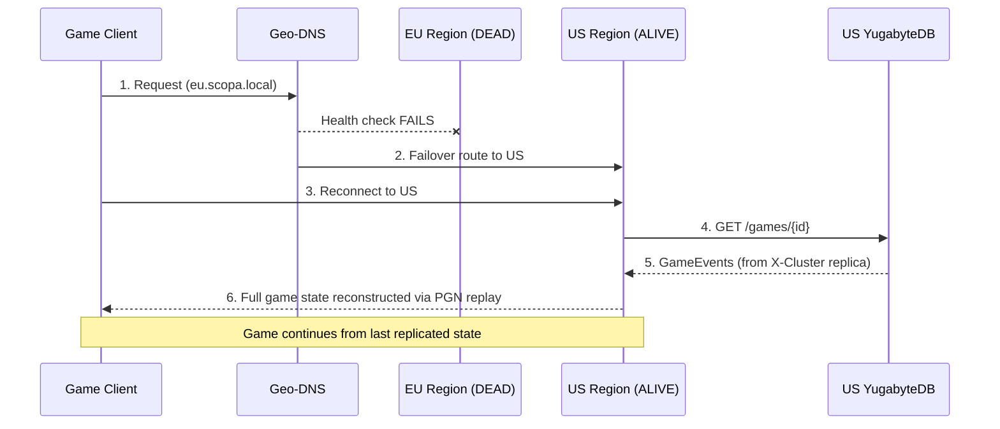

# Unified Pod Architecture with Per-Region Redis & Soketi WebSocket Tier

## Current State Analysis

The existing Helm chart deploys a **single-tier** `scopa2-app` Deployment (2 replicas) that acts as both matchmaking API and game server. It connects to a shared YugabyteDB cluster (3 masters + 3 tservers) with region-differentiated values files pointing to different tserver nodes.

**What's missing from current Helm vs the original PUML:**
- No separate "Matchmaking API" vs "Game Server" distinction — they already share one image
- No Redis layer at all (neither in Helm nor docker-compose)
- The "ephemeral game server" concept from the PUML was never implemented in Kubernetes

This actually simplifies the migration — the current chart is already closer to the target than the PUML suggests.

---

## Proposed Architecture



### Key Differences from Original PUML

| Aspect | Original PUML | New Architecture |
|---|---|---|
| **App Tier** | Separate Matchmaking API + Ephemeral Game Servers | Single `scopa2-app` pod (unified) |
| **Scaling** | Separate scaling for API and game servers | Single HPA scales the unified pod |
| **Redis** | Not present | Per-region Redis Sentinel (isolated) |
| **WebSocket** | Not present | Soketi as separate Deployment w/ Redis Pub/Sub adapter |
| **State** | Game state on ephemeral servers | Game state in Redis (cache) + YugabyteDB (persistent) |

---

## WebSocket Tier: Soketi Deployment Strategy

The app currently uses **Soketi** (Pusher-compatible WebSocket server) for broadcasting `GameStateUpdated`, `RoundFinished`, and `GameFinished` events via the `pusher` driver.

### Sidecar vs Separate Deployment

| | **Sidecar** (Soketi in same pod as Laravel) | **Separate Deployment** (dedicated Soketi pods) |
|--|--|--|
| **Scaling** | ❌ Tied to app replicas — can't scale WS independently | ✅ Independent HPA based on connection count |
| **Sticky Sessions** | ❌ Ingress sticky sessions affect both HTTP + WS | ✅ Separate Ingress rule, independent sticky sessions |
| **Resource Isolation** | ❌ A WS spike could starve the Laravel process | ✅ Separate CPU/memory limits |
| **Failure Blast Radius** | ❌ Soketi crash restarts the entire pod (app + WS) | ✅ Soketi crash only affects WS pods |
| **Simplicity** | ✅ Single Deployment, single Service | ❌ Extra Deployment + Service + Ingress path |
| **Network Hops** | ✅ `localhost:6001` — zero latency | ❌ Service DNS hop (~0.1ms, negligible) |

> [!IMPORTANT]
> **Recommendation: Separate Deployment.** The ability to scale WebSocket connections independently from HTTP request pods is critical for a real-time game. Sidecar is simpler but creates a tight coupling that becomes a bottleneck.

### How Multi-Pod Soketi Works

When you have **N Soketi pods**, a client connects to one specific pod. When Laravel broadcasts an event, it hits one Soketi pod via the Service. Without coordination, only clients on *that* pod receive the event.

**Solution:** Configure Soketi with the **Redis Pub/Sub adapter** (`SOKETI_ADAPTER_DRIVER=redis`). Every Soketi pod subscribes to Redis. When one pod receives a broadcast, it publishes to Redis, and all other pods pick it up and push to their connected clients.



This uses the **same regional Redis** we're already deploying — no extra infrastructure.

---

## Updated PUML Diagram

> [!IMPORTANT]
> This is the new replacement diagram. The Game Servers tier is gone; the single `scopa2-app` pod handles everything. Soketi is a separate Deployment using Redis as its Pub/Sub adapter.



---

## Proposed Helm Chart Changes

### Core Application Chart

#### [MODIFY] [values.yaml](file:///Users/valex/Unibo/Magistrale/Secondo-Anno/Distributed-Software-Systems/Project/scopa2-backend/helm/values.yaml)

Add Redis configuration block and HPA settings:

```diff
 replicaCount: 2
+
+autoscaling:
+  enabled: true
+  minReplicas: 2
+  maxReplicas: 10
+  targetCPUUtilizationPercentage: 70
 
 image:
   repository: scopa2
   tag: latest
   pullPolicy: Never
 
 service:
   type: ClusterIP
 
 ingress:
   host: "scopa.local"
 
 db:
   port: "5433"
   database: "yugabyte"
 
+redis:
+  host: "scopa-redis-master"
+  port: "6379"
+  password: ""
+
+soketi:
+  replicaCount: 2
+  host: "scopa-soketi-service"
+  port: "6001"
+  appId: "app-id"
+  appKey: "app-key"
+  appSecret: "app-secret"
+
 env:
   OCTANE_HTTPS: "true"
```

---

#### [MODIFY] [values-eu.yaml](file:///Users/valex/Unibo/Magistrale/Secondo-Anno/Distributed-Software-Systems/Project/scopa2-backend/helm/values-eu.yaml)

Add EU-specific Redis and Soketi hosts:

```diff
 ingress:
   host: "eu.scopa.local"
 
+redis:
+  host: "eu-scopa-redis-master.cache-eu.svc.cluster.local"
+
+soketi:
+  host: "scopa-eu-soketi-service"
+
 db:
   localNode: "yb-tserver-0.yb-tservers.db.svc.cluster.local"
   backups: "yb-tserver-1.yb-tservers.db.svc.cluster.local,yb-tserver-2.yb-tservers.db.svc.cluster.local"
```

---

#### [MODIFY] [values-us.yaml](file:///Users/valex/Unibo/Magistrale/Secondo-Anno/Distributed-Software-Systems/Project/scopa2-backend/helm/values-us.yaml)

Add US-specific Redis and Soketi hosts:

```diff
 ingress:
   host: "us.scopa.local"
 
+redis:
+  host: "us-scopa-redis-master.cache-us.svc.cluster.local"
+
+soketi:
+  host: "scopa-us-soketi-service"
+
 db:
   localNode: "yb-tserver-2.yb-tservers.db.svc.cluster.local"
   backups: "yb-tserver-0.yb-tservers.db.svc.cluster.local,yb-tserver-1.yb-tservers.db.svc.cluster.local"
```

---

#### [MODIFY] [deployment.yaml](file:///Users/valex/Unibo/Magistrale/Secondo-Anno/Distributed-Software-Systems/Project/scopa2-backend/helm/templates/deployment.yaml)

Add Redis + Soketi (Pusher) env vars to the container spec:

```diff
           env:
             - name: DB_PORT
               value: {{ .Values.db.port | quote }}
             - name: DB_DATABASE
               value: {{ .Values.db.database | quote }}
             - name: DB_HOST
               value: "{{ .Values.db.localNode }},{{ .Values.db.backups }}"
+            - name: REDIS_HOST
+              value: {{ .Values.redis.host | quote }}
+            - name: REDIS_PORT
+              value: {{ .Values.redis.port | quote }}
+            - name: REDIS_PASSWORD
+              value: {{ .Values.redis.password | quote }}
+            - name: BROADCAST_CONNECTION
+              value: "pusher"
+            - name: PUSHER_HOST
+              value: {{ .Values.soketi.host | quote }}
+            - name: PUSHER_PORT
+              value: {{ .Values.soketi.port | quote }}
+            - name: PUSHER_APP_ID
+              value: {{ .Values.soketi.appId | quote }}
+            - name: PUSHER_APP_KEY
+              value: {{ .Values.soketi.appKey | quote }}
+            - name: PUSHER_APP_SECRET
+              value: {{ .Values.soketi.appSecret | quote }}
+            - name: PUSHER_SCHEME
+              value: "http"
             {{- range $key, $value := .Values.env }}
             - name: {{ $key }}
               value: {{ $value | quote }}
             {{- end }}
```

---

#### [NEW] [hpa.yaml](file:///Users/valex/Unibo/Magistrale/Secondo-Anno/Distributed-Software-Systems/Project/scopa2-backend/helm/templates/hpa.yaml)

HorizontalPodAutoscaler for scaling the unified app pods:

```yaml
{{- if .Values.autoscaling.enabled }}
apiVersion: autoscaling/v2
kind: HorizontalPodAutoscaler
metadata:
  name: {{ .Release.Name }}-hpa
spec:
  scaleTargetRef:
    apiVersion: apps/v1
    kind: Deployment
    name: {{ .Release.Name }}
  minReplicas: {{ .Values.autoscaling.minReplicas }}
  maxReplicas: {{ .Values.autoscaling.maxReplicas }}
  metrics:
    - type: Resource
      resource:
        name: cpu
        target:
          type: Utilization
          averageUtilization: {{ .Values.autoscaling.targetCPUUtilizationPercentage }}
{{- end }}
```

---

#### [NEW] [soketi-deployment.yaml](file:///Users/valex/Unibo/Magistrale/Secondo-Anno/Distributed-Software-Systems/Project/scopa2-backend/helm/templates/soketi-deployment.yaml)

Soketi as a separate Deployment with Redis Pub/Sub adapter:

```yaml
apiVersion: apps/v1
kind: Deployment
metadata:
  name: {{ .Release.Name }}-soketi
  labels:
    app: {{ .Release.Name }}-soketi
spec:
  replicas: {{ .Values.soketi.replicaCount | default 2 }}
  selector:
    matchLabels:
      app: {{ .Release.Name }}-soketi
  template:
    metadata:
      labels:
        app: {{ .Release.Name }}-soketi
    spec:
      containers:
        - name: soketi
          image: "quay.io/soketi/soketi:latest-16-alpine"
          ports:
            - name: ws
              containerPort: 6001
              protocol: TCP
            - name: metrics
              containerPort: 9601
              protocol: TCP
          env:
            # App credentials (must match Laravel's PUSHER_* env)
            - name: SOKETI_DEFAULT_APP_ID
              value: {{ .Values.soketi.appId | quote }}
            - name: SOKETI_DEFAULT_APP_KEY
              value: {{ .Values.soketi.appKey | quote }}
            - name: SOKETI_DEFAULT_APP_SECRET
              value: {{ .Values.soketi.appSecret | quote }}
            # Redis adapter for multi-pod fan-out
            - name: SOKETI_ADAPTER_DRIVER
              value: "redis"
            - name: SOKETI_ADAPTER_REDIS_HOST
              value: {{ .Values.redis.host | quote }}
            - name: SOKETI_ADAPTER_REDIS_PORT
              value: {{ .Values.redis.port | quote }}
            - name: SOKETI_DEBUG
              value: "1"
          resources:
            requests:
              cpu: "100m"
              memory: "128Mi"
            limits:
              cpu: "250m"
              memory: "256Mi"
          livenessProbe:
            httpGet:
              path: /
              port: ws
            initialDelaySeconds: 5
            periodSeconds: 10
          readinessProbe:
            httpGet:
              path: /
              port: ws
            initialDelaySeconds: 3
            periodSeconds: 5
```

---

#### [NEW] [soketi-service.yaml](file:///Users/valex/Unibo/Magistrale/Secondo-Anno/Distributed-Software-Systems/Project/scopa2-backend/helm/templates/soketi-service.yaml)

Service to expose Soketi within the cluster:

```yaml
apiVersion: v1
kind: Service
metadata:
  name: {{ .Release.Name }}-soketi-service
spec:
  type: ClusterIP
  ports:
    - port: 6001
      targetPort: ws
      protocol: TCP
      name: ws
  selector:
    app: {{ .Release.Name }}-soketi
```

---

#### [MODIFY] [ingress.yaml](file:///Users/valex/Unibo/Magistrale/Secondo-Anno/Distributed-Software-Systems/Project/scopa2-backend/helm/templates/ingress.yaml)

Add a `/ws` path routing to the Soketi service with WebSocket upgrade support:

```diff
   annotations:
+    nginx.ingress.kubernetes.io/proxy-set-headers: "Upgrade"
+    nginx.ingress.kubernetes.io/websocket-services: "{{ .Release.Name }}-soketi-service"
 spec:
   ingressClassName: nginx
   rules:
     - host: {{ .Values.ingress.host | quote }}
       http:
         paths:
           - path: /
             pathType: Prefix
             backend:
               service:
                 name: {{ .Release.Name }}-service
                 port:
                   number: 80
+          - path: /ws
+            pathType: Prefix
+            backend:
+              service:
+                name: {{ .Release.Name }}-soketi-service
+                port:
+                  number: 6001
```

---

#### [NEW] [redis-values.yaml](file:///Users/valex/Unibo/Magistrale/Secondo-Anno/Distributed-Software-Systems/Project/scopa2-backend/helm/redis-values.yaml)

Bitnami Redis Helm chart values (deployed per-region, **no cross-region sync**):

```yaml
# redis-values.yaml
# Deploy with: helm install <region>-scopa-redis bitnami/redis -n cache-<region> -f redis-values.yaml

architecture: replication   # Master + Replicas (no cluster mode)

auth:
  enabled: false            # For local dev; enable + set password for production

replica:
  replicaCount: 2           # 1 Master + 2 Replicas = 3 nodes per region

sentinel:
  enabled: true             # Auto-failover: if Master dies, a Replica promotes
  quorum: 2

master:
  resources:
    requests:
      cpu: "100m"
      memory: "128Mi"
    limits:
      cpu: "250m"
      memory: "256Mi"
  persistence:
    size: 1Gi

replica:
  resources:
    requests:
      cpu: "100m"
      memory: "128Mi"
    limits:
      cpu: "250m"
      memory: "256Mi"
  persistence:
    size: 1Gi
```

---

## Deployment Commands

Per-region deployment would look like:

```bash
# --- EU Region ---
# 1. Deploy Redis for EU (isolated namespace)
kubectl create namespace cache-eu
helm install eu-scopa-redis bitnami/redis -n cache-eu -f helm/redis-values.yaml

# 2. Deploy App for EU
helm install scopa-eu helm/ -f helm/values.yaml -f helm/values-eu.yaml

# --- US Region ---
# 1. Deploy Redis for US (isolated namespace)
kubectl create namespace cache-us
helm install us-scopa-redis bitnami/redis -n cache-us -f helm/redis-values.yaml

# 2. Deploy App for US
helm install scopa-us helm/ -f helm/values.yaml -f helm/values-us.yaml
```

---

## Why Redis Stays Region-Local

| Concern | Solution |
|---|---|
| **Game session state** | Ephemeral — only relevant to the region serving that game. No need for cross-region sync. |
| **Laravel queues** | Each region processes its own jobs. No cross-region queue sharing. |
| **Broadcasting (Soketi)** | WebSocket connections are region-bound. Soketi's Redis adapter Pub/Sub stays local. |
| **Player data** | Persisted in YugabyteDB which already handles cross-region replication. |

Redis is used purely as a **regional cache + pub/sub + queue backend**. YugabyteDB remains the single source of truth with its built-in X-Cluster replication.

---

## Failure Scenarios & Recovery

> [!NOTE]
> **Critical architectural advantage:** The app uses an **event-sourcing** pattern. Game state is never stored directly — it's reconstructed by replaying `GameEvent` records through the deterministic `ScopaEngine(seed)`. This means game state survives any stateless-tier failure as long as the database is intact.

### Failure Severity Levels



---

### Tier 1: App Pod Failure

| Scenario | Impact | Recovery |
|---|---|---|
| **1 of N app pods crashes** | Requests in-flight on that pod fail (~1-2 requests). Other pods continue. | K8s restarts the pod in ~5s. Load balancer drains traffic away immediately via readiness probe. |
| **All app pods crash** | Region is down for HTTP. No new moves can be submitted. | HPA / Deployment controller reschedules pods. Geo-DNS health check fails → traffic reroutes to other region. |

**Can the game continue?** ✅ Yes. Game state lives in YugabyteDB (`GameEvent` rows). When pods come back (same or other region), calling `GET /games/{id}` replays the PGN and reconstructs the exact state.

---

### Tier 2: Soketi (WebSocket) Failure

| Scenario | Impact | Recovery |
|---|---|---|
| **1 of N Soketi pods dies** | Clients connected to that pod lose their WebSocket connection. Other pods unaffected. | K8s restarts the pod. **Client must reconnect** — standard WebSocket client behavior (e.g., Laravel Echo auto-reconnects). On reconnect, client calls `GET /games/{id}` to re-sync state. |
| **All Soketi pods die** | All WebSocket connections in the region drop. Players stop receiving real-time updates. | K8s reschedules pods (~15-30s). Clients reconnect automatically. **Game is NOT lost** — moves were already persisted in DB. |

**Can the game continue?** ✅ Yes. WebSocket loss only means the player doesn't see the *push* update. The client can poll `GET /games/{id}` as a fallback, or simply wait for Soketi to come back and reconnect.

> [!TIP]
> **Client-side resilience:** The game client should implement: (1) auto-reconnect with exponential backoff, (2) on reconnect, fetch full game state via HTTP, (3) optionally poll every ~5s as fallback when WS is down.

---

### Tier 3: Redis Failure

| Scenario | Impact | Recovery |
|---|---|---|
| **1 Redis replica dies** | Zero impact — reads/writes go to Master. | Sentinel detects failure, reduces quorum. K8s restarts replica. |
| **Redis Master dies** | Cache misses, Soketi Pub/Sub briefly interrupted (events not fanned out for ~10-30s). Broadcasting may fail. | **Sentinel auto-promotes** a replica to Master within 10-30s. Soketi reconnects to new Master automatically. |
| **Entire Redis cluster dies** | Cache gone (cold start). Soketi Pub/Sub broken. Laravel queues stall if using Redis driver. | K8s reschedules all pods. Cache rebuilds on first access. **No data loss** — Redis is ephemeral by design. |

**Can the game continue?** ✅ Yes, with degradation. Game moves still persist to YugabyteDB directly (no Redis in the write path). Real-time push stops temporarily but the game state is intact.

---

### Tier 4: YugabyteDB Failure

| Scenario | Impact | Recovery |
|---|---|---|
| **1 of 3 DB nodes dies** | Raft quorum maintained (2/3 alive). Automatic leader re-election if the dead node was the shard leader (~3-5s). | YugabyteDB re-replicates data to a new node automatically. Zero manual intervention. |
| **2 of 3 DB nodes die** | ⚠️ **Quorum lost.** Region loses write capability. Reads may still work from the surviving node (stale reads). | Must restore at least 1 more node to regain quorum. If infeasible, Geo-DNS routes traffic to the other region. |
| **All 3 DB nodes die** | ❌ Region is fully down for database operations. | Geo-DNS failover to other region. If X-Cluster async replication was configured, the other region has a (possibly slightly stale) copy. |

**Can the game continue?** ⚠️ Depends on replication mode:

| YugabyteDB Config | Data Loss Risk | Game Recovery |
|---|---|---|
| **Synchronous X-Cluster** | Zero data loss (RPO = 0) | ✅ Game resumes perfectly in other region |
| **Async X-Cluster** (default) | Last few seconds of events may be lost (RPO > 0) | ⚠️ Game *mostly* resumes — may lose the last 1-2 moves |
| **No X-Cluster** | All data in dead region is lost | ❌ Games hosted in that region are lost |

---

### Tier 5: Full Region Death (Worst Case)

This is the nuclear scenario — the entire EU or US region goes offline (cloud zone failure, network partition, etc.).



**Step-by-step recovery:**

1. **Geo-DNS detects failure** (~30-60s via health checks) → stops routing to dead region
2. **Client reconnects** to surviving region (auto-redirect via DNS or client retry logic)
3. **Client authenticates** against surviving region (user accounts are in YugabyteDB, replicated)
4. **Client fetches game state** via `GET /games/{id}` — the `ScopaEngine` replays all `GameEvent` rows from the X-Cluster replica
5. **Game resumes** — the next move writes to the surviving region's DB
6. **When dead region recovers** — X-Cluster resync catches it up; original region can resume serving new games

> [!CAUTION]
> **The async replication gap:** With async X-Cluster, there's a window (typically < 1 second under normal load) where the most recent `GameEvent` writes haven't replicated yet. If a player submitted a move 200ms before the region died, that move may be lost. The player would need to re-submit it after failover. This is the fundamental CAP theorem tradeoff — we prioritize Availability + Partition tolerance over absolute Consistency.

---

### Recovery Summary Matrix

| Component Dies | Game Interrupted? | Data Lost? | Recovery Time | Auto-Recovery? |
|---|---|---|---|---|
| 1 App pod | No | No | ~5s | ✅ K8s restart |
| All App pods | Yes (HTTP) | No | ~15-30s | ✅ K8s + Geo-DNS |
| 1 Soketi pod | WS only | No | ~5s + client reconnect | ✅ K8s + client |
| All Soketi pods | WS only | No | ~15-30s + client reconnect | ✅ K8s + client |
| Redis Master | Brief WS hiccup | No (ephemeral) | ~10-30s | ✅ Sentinel |
| Redis cluster | Cache cold start | No (ephemeral) | ~30-60s | ✅ K8s |
| 1 DB node | No | No | ~3-5s | ✅ Raft re-election |
| 2 DB nodes | Yes (writes) | No | Manual | ❌ Needs intervention |
| Full region | Yes | Maybe (last few ms) | ~30-60s | ✅ Geo-DNS + X-Cluster |

---

## Verification Plan

### Manual Verification
1. **Helm template rendering** — `helm template scopa-eu helm/ -f helm/values.yaml -f helm/values-eu.yaml` should produce valid manifests with Redis, Soketi, and HPA resources
2. **Redis connectivity** — After deploying, verify Laravel can reach Redis via `php artisan tinker` → `Redis::ping()`
3. **Soketi pods running** — `kubectl get pods -l app=scopa-eu-soketi` should show 2/2 Ready
4. **WebSocket connectivity** — Verify Ingress routes `/ws` to Soketi by connecting a WS client
5. **Multi-pod fan-out** — Broadcast an event; verify clients on different Soketi pods all receive it
6. **HPA behavior** — `kubectl get hpa` confirms autoscaler is registered
7. **Region isolation** — Confirm EU Redis pods are in `cache-eu` namespace and US Redis pods in `cache-us`
